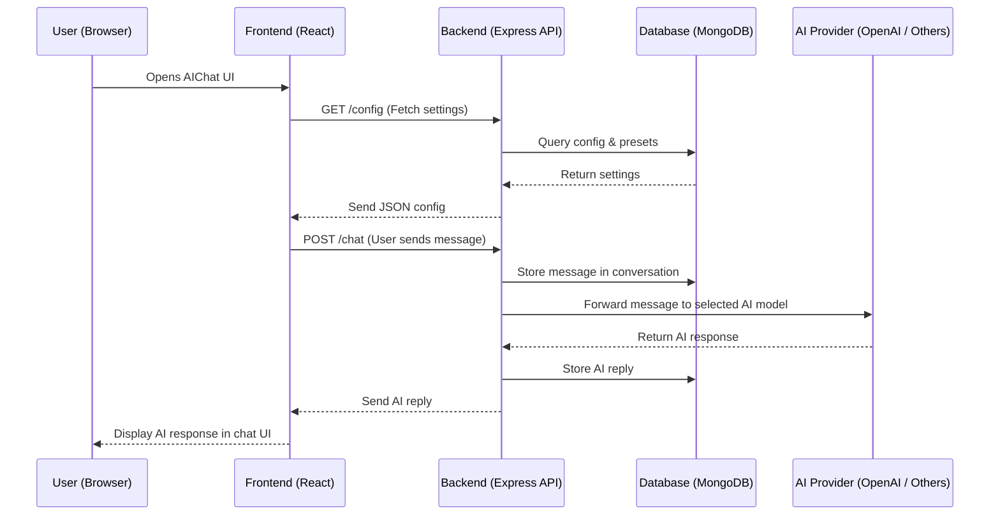
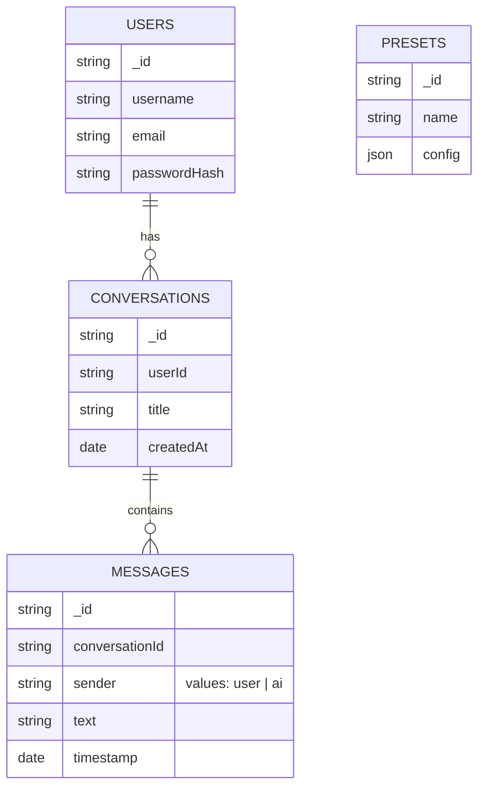

# AIChat Project Overview

This document provides a **high-level technical overview** of AIChat (forked from LibreChat). It explains how the **frontend and backend interact**, along with a **database schema overview** to help contributors quickly understand the system.

---

## 1. Code Flow: Frontend ↔ Backend Interaction

AIChat follows a client-server architecture:

* **Frontend:** Built with React, communicates via REST APIs & WebSockets.
* **Backend:** Node.js + Express server, acts as the API gateway, connects to DB & AI providers.
* **Database:** MongoDB (stores users, messages, presets, conversations).

### Sequence Diagram

This flow repeats for each user message. Streaming (if enabled) sends partial tokens to the UI in real-time.

---

## 2. Database Schema Overview

AIChat uses **MongoDB**, with collections focused on user data, chat history, and configuration.

### Entity-Relationship Diagram

### Key Points:

* **USERS** → One user can have many conversations.
* **CONVERSATIONS** → Each conversation stores multiple messages.
* **MESSAGES** → Linked to conversations for full history.
* **PRESETS** → Stores reusable model configurations.

---

## 3. Notes

* Supports multiple AI providers (OpenAI, Azure, Anthropic, etc.).
* Backend handles authentication, rate-limiting, and persistence.
* Frontend is provider-agnostic: it only cares about responses from API.

---

**This file should be kept updated** whenever the schema or major data flow changes.
