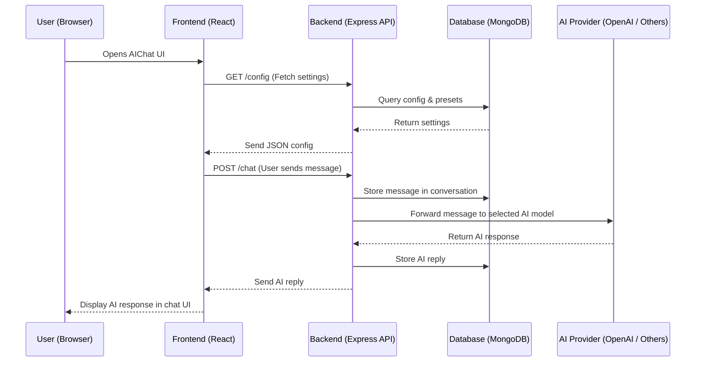
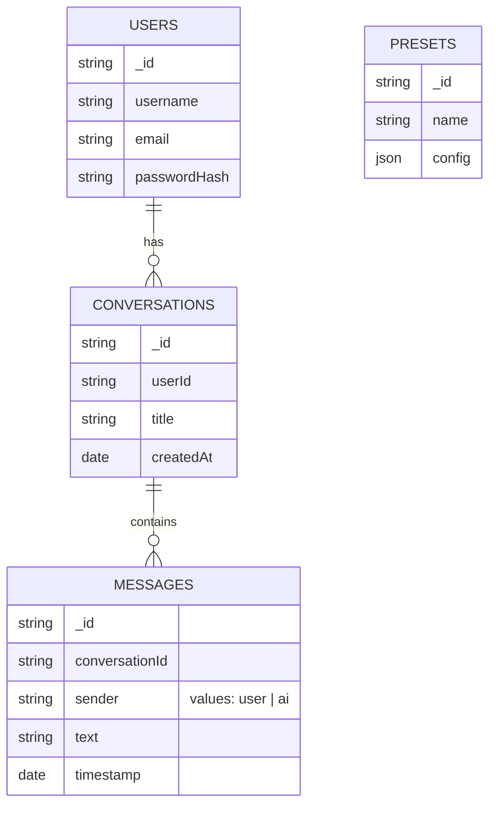

# AIChat Overview

This document provides a **high-level technical overview** of AIChat (forked from LibreChat). It explains how the **frontend and backend interact**, along with a **database schema overview** to understand the entire system.

---

## 1. Code Flow: Frontend ↔ Backend Interaction

AIChat follows a client-server architecture:

* **Frontend:** Built with React, communicates via REST APIs & WebSockets.
* **Backend:** Node.js + Express server, acts as the API gateway, connects to Database & AI providers(OpenAI, Google, etc).
* **Database:** MongoDB (stores users, messages, presets, conversations).

1. **User Opens the App**  
   The browser loads the React frontend, which immediately requests initial configuration (available AI models, settings, etc.) from the backend.

2. **Frontend Fetches Config**  
   The React app calls `GET /config`.  
   The backend fetches app settings (presets, available providers, etc.) from MongoDB and returns them as JSON.

3. **User Sends a Message**  
   When the user types a message and clicks send, the frontend sends a `POST /chat` request to the backend.

4. **Backend Processes the Request**  
   The backend:
   * Stores the user's message in the **messages** collection.
   * Forwards the message to the selected **AI provider** (OpenAI, Anthropic, etc.).
   * Waits for the AI’s response.

5. **AI Response Returned**  
   The backend stores the AI response in the database and sends it back to the frontend.

6. **Frontend Updates the UI**  
   The React app updates the chat interface, displaying the AI’s reply to the user.

* We run the npm run backend command on our terminal to start the application. Using the port:3080 starts the application.
* Frontend loads the React app assets from `client/` and fetches the config settings from `.env` like available AI providers, user settings.
* Backend server (Node.js) starts listening to this port. It connects Database for users, conversation history, messages data. Also connects to AI providers and loads middleware like auth.

* We login via the frontend forms (Credentials and user data are stored in DB).

* When we submit a prompt, the frontend sends a HTTP request to backend with the prompt, metadata, model, conversationID, etc
* Backend receives the request and validates it and checks for the previous messages in conversation (if any)
* Backend then sends message + context to the AI provider
* Once the backend recieves the response from the AI, it stores in the database and returns the response to the frontend and updates UI.

### Detailed Flow (Step-by-Step)

1. **Application Startup**  
   * The backend is started with `npm run backend`. It loads environment variables from `.env`, connects to MongoDB, initializes middleware (authentication, logging, etc.), and listens on **port 3080**.  
   * The frontend is started with `npm run frontend` and serves the React UI.

2. **User Opens the App**  
   * The browser loads the React frontend.  
   * Immediately, the frontend sends a `GET /config` request to fetch available AI models, presets, and settings.

3. **Backend Responds with Configuration**  
   * The backend queries MongoDB for presets and settings.  
   * A JSON response is returned to the frontend, allowing it to render model dropdowns, user-specific data, and chat UI.

4. **User Authentication**  
   * If login is required, credentials are sent to the backend.  
   * The backend validates the credentials, creates a session/JWT token, and returns it to the frontend for future authenticated requests.

5. **User Sends a Message**  
   * When the user sends a message, the frontend sends a `POST /chat` request containing:
     * Message text  
     * Selected AI model/provider  
     * Conversation ID (if applicable)  
     * Metadata  

6. **Backend Handles the Request**  
   * The backend stores the message in the **messages** collection.  
   * It gathers conversation context and forwards the request to the selected AI provider (e.g., OpenAI, Google Gemini).

7. **AI Provider Responds**  
   * The AI provider processes the input and sends a reply.  
   * The backend stores this reply in the database and sends it back to the frontend.

8. **Frontend Updates the UI**  
   * The frontend receives the response and displays it in the chat interface.  
   * If streaming is enabled, the message appears progressively as tokens are received.

### Sequence Diagram

---

## 2. Database Schema Overview

AIChat uses **MongoDB**, with collections focused on user data, chat history, and configuration.

### Entity-Relationship Diagram

### Tables:

* **USERS** → One user can have many conversations.
* **CONVERSATIONS** → Each conversation stores multiple messages.
* **MESSAGES** → Linked to conversations for full history.
* **PRESETS** → Stores reusable model configurations.

* NOTE : There exists other tables also.

---

## 3. Notes

* Supports multiple AI providers (OpenAI, Azure, Anthropic, etc.).
* Backend handles authentication, rate-limiting, and persistence.
* Frontend is provider-agnostic: it only cares about responses from API.
